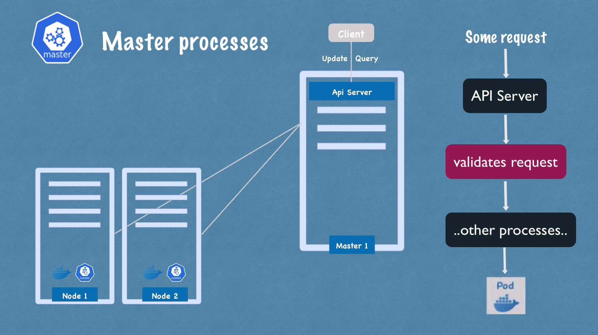
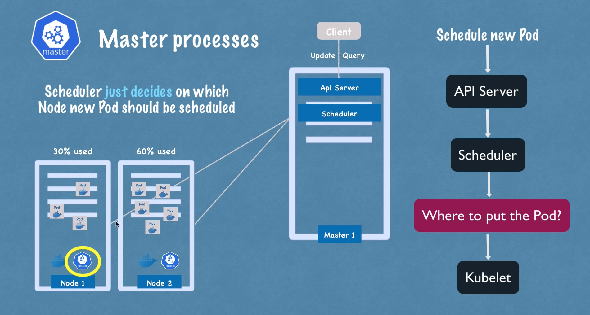
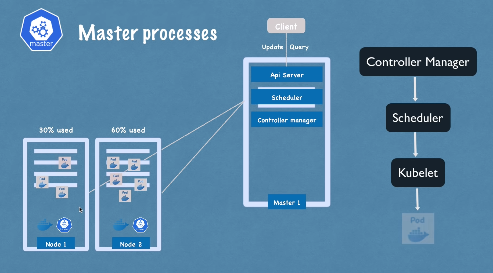
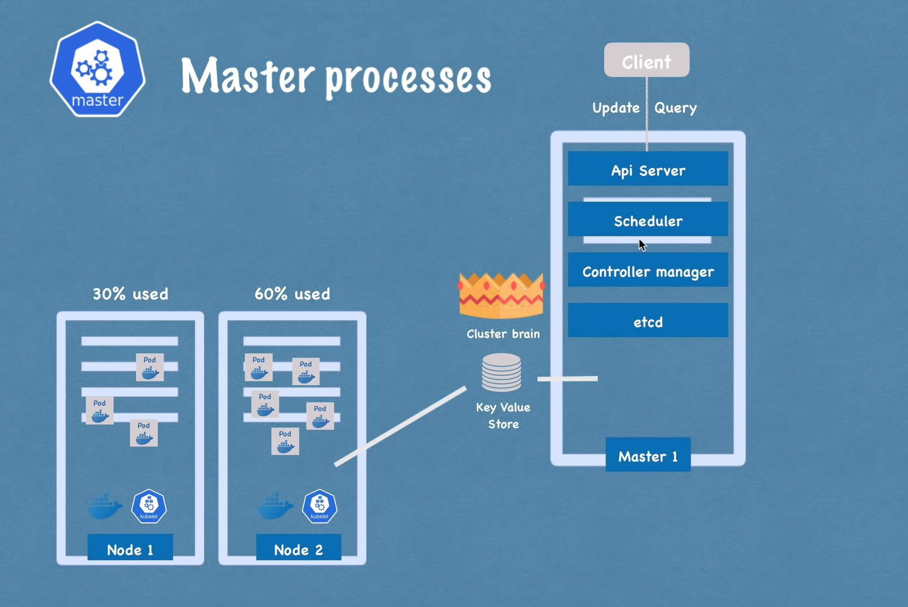

## Node
* Cada node possui múltiplos POD's;
* 3 processos estão sempre instalados em um node:
    - kube-proxy: The Kubernetes network proxy runs on each node. This reflects services as defined in the Kubernetes API on each node and can do simple TCP, UDP, and SCTP stream forwarding or round robin TCP, UDP, and SCTP forwarding across a set of backends. Service cluster IPs and ports are currently found through Docker-links-compatible environment variables specifying ports opened by the service proxy. There is an optional addon that provides cluster DNS for these cluster IPs. The user must create a service with the apiserver API to configure the proxy.
    - container runtime: usado para execução da imagem, como cada node executa 1 ou N PODs e cada POD executa imagens, o runtime precisa estar instalado em todos os nodes.
    - kubelet: The kubelet is the primary "node agent" that runs on each node. Kubelet interacts with both - the container and node. Kubelet starts the POD with a container inside.
    The kubelet works in terms of a PodSpec. A PodSpec is a YAML or JSON object that describes a pod. The kubelet takes a set of PodSpecs that are provided through various mechanisms (primarily through the apiserver) and ensures that the containers described in those PodSpecs are running and healthy. The kubelet doesn't manage containers which were not created by Kubernetes.

## Master Node
É o node responsável por gerenciar os demais. 4 processos executam em todos os master nodes.

### Master Process - API Server
Muito importante pois provê um único entrypoint para o cluster.
- Funciona como um cluster gateway;
- Atua como um gatekeeper para autenticação;

### Master Process - Scheduler
The Kubernetes scheduler is a control plane process which assigns Pods to Nodes. The scheduler determines which Nodes are valid placements for each Pod in the scheduling queue according to constraints and available resources. The scheduler then ranks each valid Node and binds the Pod to a suitable Node.
- Scheduler just decides on wich Node new POD should be scheduled.

### Master Process - Controller Manager
The Kubernetes controller manager is a daemon that embeds the core control loops shipped with Kubernetes. In applications of robotics and automation, a control loop is a non-terminating loop that regulates the state of the system. In Kubernetes, a controller is a control loop that watches the shared state of the cluster through the apiserver and makes changes attempting to move the current state towards the desired state. Examples of controllers that ship with Kubernetes today are the replication controller, endpoints controller, namespace controller, and serviceaccounts controller.
- Detect cluster state changes;
- Se um POD morre, o controller manager identifica e tenta recuperar assim que possível.

### Master Process - ETCD
Estrutura chave-valor que contém o estado do cluster. Funciona como o cérebro do cluster. Se um POD morre ou é criado, fica gravado essas informações no etcd.
- Dados da aplicação NÃO são salvos no etcd.

