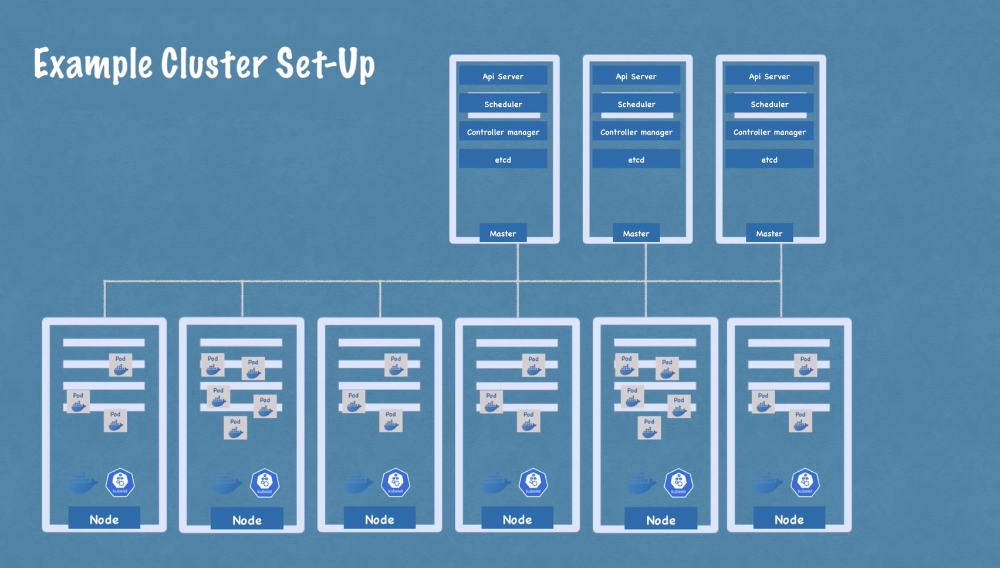

## POD
Um POD é basicamente uma abstração sobre um container, é a menor unidade do k8s. 
* Quando um POD usa uma imagem, nós só interagimos com a camada de abstração do k8s;
* Usualmente executamos somente um contâiner por POD;
* Cada POD possui um IP interno para comunicação entre os POD's (verificar sobre uso de services, já que um IP pode ser alterado);
* A ideia é que um POD seja efêmero, portanto ao tratar de DB, deve-se utilizar mecanismos próprios do k8s.

## Nodes
O Kubernetes executa sua carga de trabalho colocando contêineres em Pods para serem executados em Nós. Um nó pode ser uma máquina virtual ou física, dependendo do cluster. Cada nó é gerenciado pela camada de gerenciamento e contém os serviços necessários para executar Pods.
* Normalmente, você tem vários nós em um cluster.
* Os componentes em um nó incluem o kubelet, um agente de execução de contêiner, e o kube-proxy.
[Mais detalhes](Nodes.md)

## Service
O Service fica anexado ao POD. O ciclo de vida do POD e da Service não estão diretamente conectados, portanto vários PODs podem ser criados e destruídos e o IP de acesso ao Service (que concentra esses PODs) e o próprio Service, continua válido.
* O service também possui um load balancer;
* As replicas de um POD (Node) são gerenciadas pelo mesmo service;

## Deployment
Deployment é uma abstração de POD onde podemos definir quantas réplicas determinado POD terá, qual versão da imagem da aplicação que será executada etc. O deployment gerencia os PODs e o Service anexa esses PODs e provê load balancer, IP fixo (via IP do service) etc.
* O POD é uma abstração sobre o container e o deployment é uma abstração sobre o POD.
* Na prática lidamos com Deployments e não PODs diretamente.
* Databases não podem ser replicados via Deployments pois possuem estado, para esses casos devemos utilizar os objetos StatefulSet.

## Ingress
É um objeto que serve para encaminhar requisições ao seu respectivo Service. Roteia o tráfego dentro do cluster.

## ConfigMap
Objeto externo que pode ser utilizado para prover configurações dos POD's, por exemplo, o URL de uma database. NÃO se deve colocar credenciais em um ConfigMap.

## Secret
É o componente usado para guardar informações sensíveis, como credenciais, a serem usadas pelos containers.

## Volumes
Local utilizado para salvar informações que não podem ser efêmeras, como dados de DB. O volume persiste dados fora do POD, podendo ser na própria máquina "hospedeira" como em uma outra fora do cluster.

## Cluster
É um conjunto de máquinas. Cada cluster possui um node (máquina) chamado master
que controla os demais.

# Probes

Liveness Probe